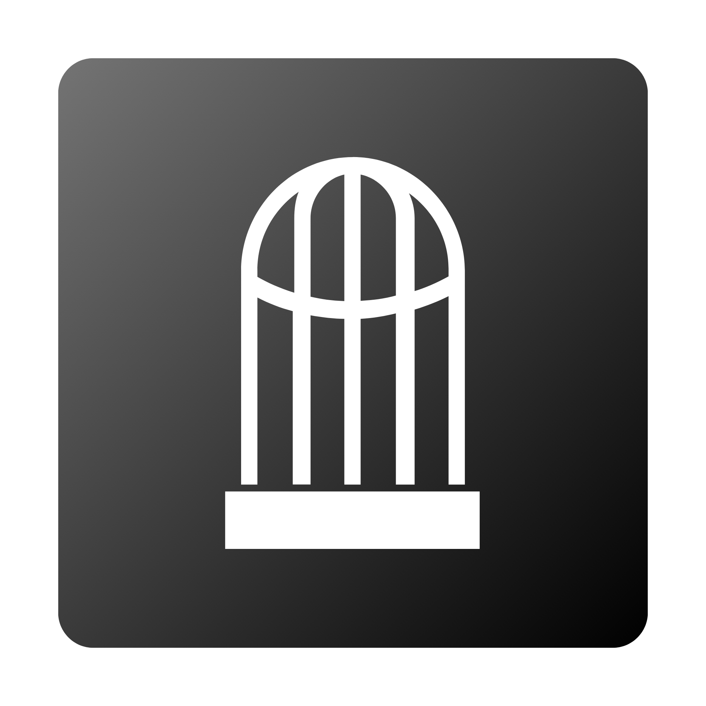
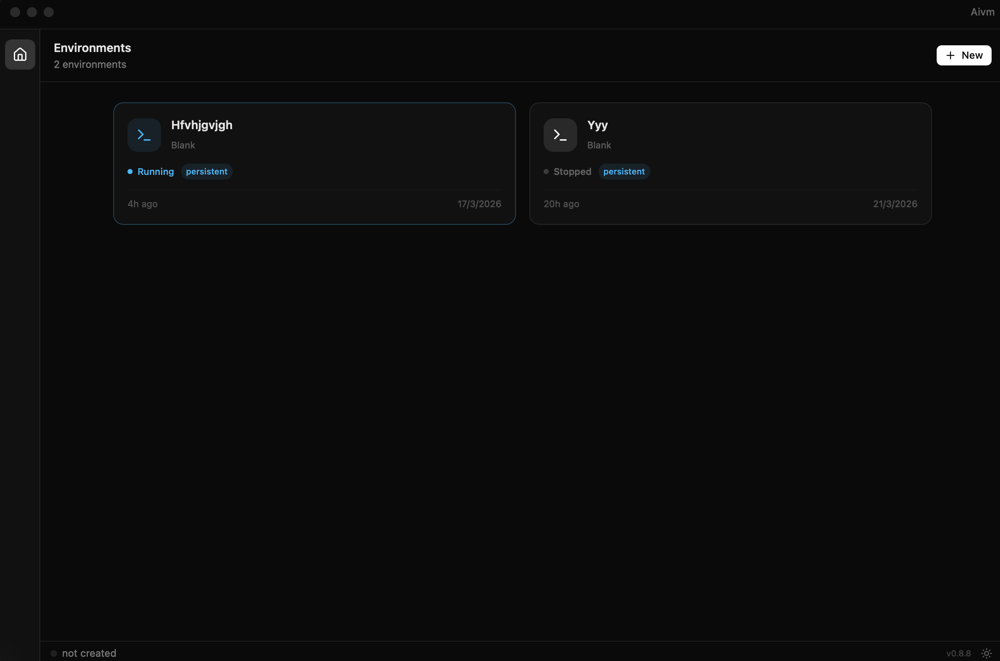

<p align="center">
  
</p>

<h1 align="center">Clawcage</h1>

<p align="center">
  <strong>Cage your AI agents before they rage against your machine.</strong>
</p>

<p align="center">
  <a href="https://github.com/hackyguru/clawcage/releases/latest"></a>
  <a href="LICENSE"></a>
  <a href="https://github.com/hackyguru/clawcage/actions"></a>
  <a href="https://clawcage.hackyguru.com"></a>
</p>

<p align="center">
  <a href="https://clawcage.hackyguru.com">Website</a> &middot;
  <a href="https://github.com/hackyguru/clawcage/releases/latest">Download</a>
</p>

---

Native macOS app that sandboxes AI agents in isolated Linux VMs using Apple's Virtualization.framework. Every agent runs in an air-gapped environment with full network inspection, credential isolation, and kill-switch control.

Built with **Rust**, **Tauri 2.0**, and **React**.

<p align="center">
  
</p>

## Features

- **Air-Gapped Sandbox** — Each AI agent runs in a full Linux VM with no direct internet access. All traffic is routed through a MITM proxy with domain-level allow/block policies.
- **Credential Isolation** — API keys never enter the guest VM. The host-side proxy injects credentials into upstream requests.
- **Full Visibility** — See every HTTP request, tool call, and file change in real time.
- **Network Policy Engine** — Granular domain allow/block lists with HTTP method+path rules. Corporate policies override user settings.
- **Ephemeral by Default** — VMs are stateless. The scratch disk is formatted fresh every boot. Nothing survives across sessions.
- **Any AI Agent** — Not vendor-locked. Run Claude, Gemini, ChatGPT, Codex, or any CLI tool of your choice.

## Install

Download the latest `.dmg` from [**Releases**](https://github.com/hackyguru/clawcage/releases/latest) and drag Clawcage to your Applications folder.

> Requires **macOS 13+** on **Apple Silicon**.

On first launch, the app downloads the Linux rootfs (~443 MB) automatically.

## Usage

### GUI

```sh
open /Applications/Clawcage.app
```

### CLI

Run commands inside the sandboxed Linux VM:

```sh
clawcage uname -a
clawcage echo hello
clawcage 'ls -la /proc/cpuinfo'
```

The CLI binary lives at `/Applications/Clawcage.app/Contents/MacOS/clawcage`.

## Development

### Prerequisites

- macOS 13+ on Apple Silicon
- [Rust](https://rustup.rs/) via rustup
- [Node.js](https://nodejs.org/) 20+ and [pnpm](https://pnpm.io/) (`npm install -g pnpm`)
- [just](https://github.com/casey/just) (`brew install just`)
- [Tauri CLI](https://tauri.app/) (`cargo install tauri-cli`)
- [Podman](https://podman.io/) or Docker (`brew install podman`)
- [b3sum](https://github.com/BLAKE3-team/BLAKE3) (`brew install b3sum`)
- aarch64 musl cross-compiler (`brew install messense/macos-cross-toolchains/aarch64-unknown-linux-musl`)

### Quick Start

```sh
just doctor         # check all tools are installed
just build-assets   # build VM assets (kernel, initrd, rootfs) — ~10 min first time
just dev            # build + sign + run app with hot-reloading frontend
```

Or for frontend-only work (no VM needed):

```sh
just ui             # mock mode dev server on http://localhost:5173
```

### Project Structure

```
crates/clawcage-core/     VM library (config, boot, serial, vsock, MITM proxy)
crates/clawcage-app/      Tauri binary (GUI, CLI, IPC commands, state)
crates/clawcage-agent/    Guest agent (PTY bridge, net proxy, cross-compiled for aarch64)
frontend/                 Vite 6 + React 19 + Tailwind v4
images/                   VM image tooling (Dockerfiles, build.py, init script)
assets/                   Built VM assets (gitignored)
```

### Commands

| Command | Description |
|---------|-------------|
| `just dev` | Build + sign + run with frontend dev server |
| `just ui` | Frontend-only dev server with mock data |
| `just run` | Cross-compile + repack + build + boot VM (~10s) |
| `just run "CMD"` | Run a command in the VM |
| `just build-assets` | Full VM asset rebuild via Docker/Podman |
| `just test` | Unit tests + cross-compile + frontend type-check |
| `just full-test` | Everything: test + in-VM diagnostics + integration + bench |
| `just install` | Full test + release build + install to /Applications |
| `just clean` | Remove all build artifacts |

### Testing

```sh
cargo test --workspace    # Rust unit & integration tests
just test                 # full host-side test suite
just run "clawcage-doctor"  # in-VM sandbox diagnostics
just full-test            # everything end-to-end
```

## Security

Clawcage assumes the AI agent inside the VM is **adversarial**:

- **Hardware VM isolation** — Apple Silicon Stage 2 page tables, no shared memory
- **No network interface** — no NIC exists in the VM. All traffic goes through the MITM proxy.
- **Read-only rootfs** — system binaries are immutable
- **Boot asset integrity** — BLAKE3 hashes verified before VM boots
- **No systemd, no services** — PID 1 is a minimal init script

## Auto-Update

The app includes Tauri's updater plugin. When a new version is published to GitHub Releases, the app offers to download and install the update automatically.

## License

This project is licensed under [**CC BY-NC 4.0**](LICENSE) — free for non-commercial use with attribution. See the [LICENSE](LICENSE) file for details.

## Credits

Built by [Kumaraguru Thambidurai](https://github.com/hackyguru).

If you use Clawcage in your work, a mention or link back is appreciated.
